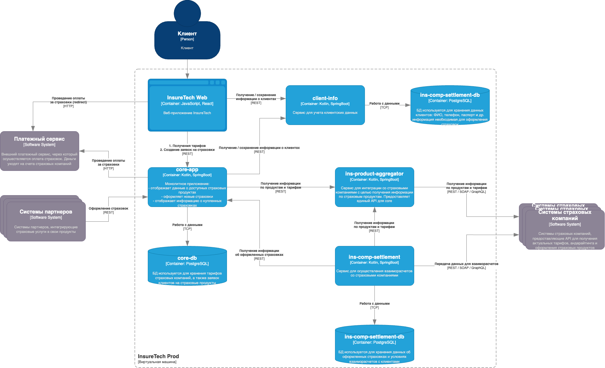

# Сдача проектной работы 8 спринта

На этот раз вы выступите в роли архитектора ПО для InsureTech. Компания предоставляет агрегационные услуги в сфере страхования. Она работает с частными и корпоративными клиентами:

- частным клиентам компания предлагает удобный сайт для подбора и оформления страховок,
- корпоративным клиентам и партнёрам предоставляет API для интеграции страховых услуг в их продукты.

Сейчас основной продукт InsureTech — это страхование жизни.

### Проблемы компании

Компания успешно запустила MVP своего приложения и планирует активно развиваться дальше. Всё бы хорошо, но приложение столкнулось со всеми классическими проблемами быстрого роста:

1. **Сайт медленно загружает страницы.** Когда нагрузка на приложение повышается, пользователи массово жалуются на то, что страницы грузятся по несколько минут или не загружаются вообще. При этом максимально зафиксированная нагрузка на запросы поиска составила 50 RPS, а на запросы оформления — 10 RPS. Такое положение дел плохо влияет на показатели NPS и retention.
2. **Нарушается SLA для B2B-клиентов.** Менеджеры уже неоднократно получали сообщения от партнёров, что SLA API не соответствует заявленному. В ходе изучения таких инцидентов выяснилось, что в эти периоды количество запросов от одного из партнёров кратно возрастало. Оно достигало суммарно 250 RPS на все вызываемые операции. По сути, один из партнёров «сжирал» все ресурсы приложения. С этим партнёром изначально договорились, что нагрузка не будет превышать 20 RPS.
3. **Приложение падает.** InsureTech несколько раз столкнулась с проблемой недоступности приложения. Команда реагировала на проблему очень медленно, поскольку узнавала о ней от пользователей. Каждый час простоя сервис несёт финансовые убытки — примерно 500 тысяч рублей. Также бизнес несёт репутационные потери: в СМИ выходят негативные публикации, у сервиса низкие показатели удовлетворённости пользователей, а некоторые партнёры уже заявили о нежелании продлевать сотрудничество.

InureTech планирует в ближайшее время провести большую рекламную кампанию. Ожидается существенный прирост пользователей.

Вам как архитектору нужно проработать описанные проблемы и предложить для них решения. В текущем состоянии приложение является «узким горлышком» для развития бизнеса.

### Архитектура приложения

Основные компоненты приложения:

- **core-app** — монолитное бэкенд-приложение. Оно отвечает за отображение доступных клиенту продуктов, оформление заявок на новые страховки и отображение уже оформленных.
- **client-info** — сервис управления клиентскими данными. Он передаёт данные core-app для оформления страховок. Если пользователя нет в базе данных или его данные изменились, в процессе оформления страховки сервис client-info вносит данные в базу. Он же отвечает за отображение и редактирование клиентских данных в личном кабинете.
- **ins-product-aggregator** — сервис интеграции со страховыми компаниями для получения информации о продуктах. Ещё он запрашивает у разных партнёров предложения по ОСАГО для конкретного автомобиля. Сервис предоставляет единый API, агрегируя данные от всех страховых компаний.
- **ins-comp-settlement** — сервис взаиморасчётов со страховыми компаниями. Раз в месяц он отправляет перечень оформленных страховок в страховые компании для расчёта выплаты агентских премий.
- Веб-приложение для клиентов сервиса.

Для деплоя всех приложений используется кластер Kubernetes, расположенный в одной зоне доступности.

В качестве базы данных используется PostgreSQL. Каждый сервис, использующий БД, имеет отдельную схему данных. БД развёрнута на отдельной ВМ в единственном экземпляре.

Взаимодействие между фронтендом и бэкендом происходит посредством REST.

API предоставляет партнёрам доступ напрямую через LoadBalancer Kubernetes, который доступен в сети Интернет.

Бэкенд-приложение интегрировано с пятью страховыми компаниями.

Вот диаграмма контейнеров приложения в модели C4:

# Как подготовиться к работе

Первым делом — приготовьтесь к работе над проектом.

**Настройте draw.io:**

1. Установите draw.io или откройте онлайн-редактор. Используйте тот способ, который вам удобнее.
2. В draw.io установите библиотеки иконок Yandex Cloud для [сервисов](templates/template_Yandex_Cloud_services_oct_23.xml) и [контейнеров](templates/template_Yandex-Cloud-containers_oct_23.drawio.xml).

**Установите инструменты, которые нужны для выполнения заданий:**

1. [Minikube](https://kubernetes.io/ru/docs/tasks/tools/install-minikube/).
2. [Kubectl](https://kubernetes.io/ru/docs/tasks/tools/install-kubectl/).
3. [Python](https://www.python.org/downloads/).
4. Pip
5. [Locast](https://locust.io/). Чтобы его установить, потребуется pip.

**Подготовьте репозиторий, куда вы будете загружать решения заданий:**

1. Проект этого спринта вы будете сдавать в Git-репозитории. Создайте публичный репозиторий в GitHub или GitLab. Назовите его «architecture-insuretech».
2. Проект состоит из шести заданий. Решение каждого задания нужно будет залить в отдельную директорию. Создайте в репозитории шесть директорий и назовите их «Task1», «Task2», «Task3», «Task4», «Task5» и «Task6».
3. Чтобы ревьюеру было проще проверять вашу работу, а вам отслеживать изменения на разных итерациях, загрузите файлы в свой репозиторий и сделайте пулл-реквест. На ревью нужно отправить ссылку на пулл-реквест.

**Повторите теорию, которая точно пригодится:**

1. Как документировать решения с помощью модели C4. Мы рассказывали про это в спринте «Создание микросервисов, построение пайплайна CI/CD», тема называется «Построение микросервисного лендскейпа».
2. Синтаксис манифестов Kubernetes.
3. Синтаксис конфигураций Nginx.
4. Синтаксис OpenAPI (Swagger).
5. Синтаксис схем GraphQL.

Когда всё будет готово, можете смело приступать к заданиям!
